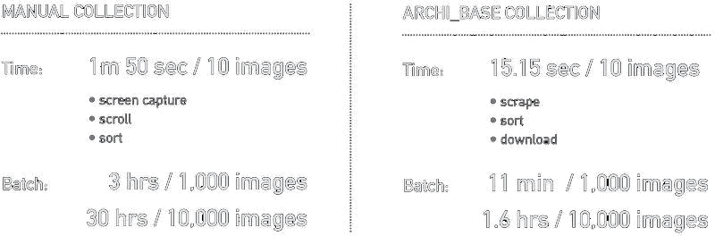

<br>


## About 

Archi-Base is an automated tool to create very large datasets of labelled and sorted architectural imagery for computer-vision model training and experiments. 

## Project Page

<br>

```
www.michaelhasey.com/archi_base
```

## Table of Contents

<br>

- [Background](#Background)
- [Pipeline](#Dataset)
- [Model](#Model)
- [Performance](#Performance)
- [References](#References)
- [Citation](#Citation)

<br>

## Background

<br>

The current method of creating large databases of architectural image data is inadequate and slow. To create a custom image database today, a user must manually search through multiple and scattered image sources, filter through thousands of un-labelled and non-relevant images, download the correct images one by one, and then painstakingly label and sort each image into their corresponding folders to prepare for training.  


Archi-Base solves this problem by providing an online tool that autonomously finds, labels, and sorts architectural images into custom datasets of any size in a fraction of the time.  Instead of taking 30 hours to manually create a 10,000 image dataset, Archi-Base can complete this task in an hour with zero human interaction required. Using this tool, datasets of thousands of currated and labeled images of any architects work, any building type or style and from any location can be rapidly created. 

<br>


<br>

## Pipeline

<br>

Archi-Base uses a 2-step pipeline to create large architectural image datasets.

1. An image scraping tool that autonomously searches for and downloads user defined images from multiple online image databases.  Images can be of any building type, any building designed by a specific architect, or any buildings from a specific region. 
2. A pre-trained ResNet-32 model which classifies, labels and sorts each scraped image into a corresponding folder.  

While a robust 100,000 image dataset would take 330 hours to create manually, Archi_base completes this task in just 16 hours.

<br>
<br>


<br>

## Model

Archi-Base uses a ResNet-32 model for Image Classification due to its superior classification abilities over standard, “vanilla” neural networks.  Here, the model has been trained to detect whether an image is of a building interior, exteriors, aerial view, or an image containing people in the foreground, or parts of buildings, or building textures. Once learned, our model can classify whether new images belong to any of these class categories and then label and sort them into folders accordingly.

<br>

To run Archi-Base, follow the instructions and steps within the provided notebook below

```
2_Scraper_Predictor_Model.ipynb
```

## Performance

<br>

See below to see performance based benchmarks comparing the time in which it takes Archi-Base to build large image datasets vs. manually creating a similarly-sized dataset by hand.



<br>


## Proposed GUI

<br>

A proposed user facing GUI to detect land-based injustices against the Maasai is shown below.  This would allow users to monitor, detect and analyze various land based injustices (village burns, fenced land which may indicate illage land grabs, and forced evictions, etc) as well as conduct population counts and tracking.  

<br>


## References

<br>

1. Yolo-V3 [https://github.com/eriklindernoren/PyTorch-YOLOv3](https://github.com/eriklindernoren/PyTorch-YOLOv3)
2. labelImg[https://github.com/tzutalin/labelImg] (https://github.com/tzutalin/labelImg)

## Citation

<br>

If you find this project useful in your research, please consider citing:

``` 
@misc{mhasey2021,
    title={Maasai Skywatch},
    author={Michael Hasey},
    year={2020},
}
```


## Description

Archi_base is a tool to automatically create very large datasets of labelled and sorted architectural imagery for ML / AI based modeling. It is meant to be used by architects, design offices, researchers, academics, students & anyone else who is interested in using architectural images to train deep neural networks.

The current method of aggregating large databases of architectural imagery are inadequate and slow.  Traditionally, if a user wants to acquire a dataset of thousands of images of a particular architects work, they need to manually search multiple image sources, filter through non-relevant images, download relevant images and then sort them into folders that correspond with their view (interior images, exterior images, aerial images, etc).  On average, it takes about 1 minute and 50 seconds to manually look for, download, and sort 10 images.  As a result, the manual method would take 30 hours of manual labour to build a robust dataset of 10,000 images for deep neural network training.  

Archi_Base solves this problem by providing a autonomous tool to rapidly search for, find, download, and sort images into their corresponding subject folders.  Instead of taking 30 hours to manually create a 10,000 image dataset, archi_base can complete this task in just over an hour with zero human interaction needed.

In order to do this, Archi_base employs a 3-step pipeline that leverages sofisticated AI & ML computer vision technology.  For the first step, Archi_base builds a ResNet-32 Image Classification model that is trained on a set of 2000 labelled images sorted into 5 different categories (aerial views, street views, close-up views, views of architectural textures, and interior views).  In step 2, the user is asked to identify the target, or the subject of the dataset.  This will be the topic that Archi_base searches and aggregates images for and can be anything from an architects name, an architectural firm, an architectural style or a particular building.  Then, the user is asked to specify the number of images to be included in the datset.  This can be anything from 100 images to well over 100,000 dependent on image availability.  After entering this information, Archi_base uses automatically employs a webscraper to find and download images associated with enetered target query and within the range amount specified.  In step 3, the final step, archi_base uses the previously created and trained ResNet-32 model to classify each downloaded image, label it and then place it into its corresponding folder.  For example, if an image is taken of a building from a street view location, Archi_Base will classify it as being in the "Street view" category, will label it as "streetview_1", and then place it into the "streetview" folder.  After step 1, 2 and 3 are complete, the result is a very large, labelled and robust dataset of sorted architectural imagery of the search query specified.

As this process only requires the user to specify the target subject and amount, Archi_base works in a completely autonomous fashion and saves the user a huge amount of time and effort.  While a robust 100,000 image dataset would take 330 hours to create manually, Archi_base completes this task in just 16 hours.

Currently, Archi_base is the fastest and easiest way to make custom, very large and robusy architectural imagery datasets for AI deep learning projects of any kind.
    
## Data
    
- 2000 images of architectural related subjects

    - zaha hadid building images
        - 300 street view images
        - 300 interio view images
        - 300 aerial view images
        - 300 close-up view images
        - 300 architectural texture images

    - miscellaneous images
        - 200 books / posters images
        - 100 people images
        - 200 drawings / sketches images

## Collab Notebooks

1. 1_Training_Model.ipynb

    - Resnet-32 (deep residual learning neural network for image recognition)
    - FastAi architecture & backend
    - PyTorch library
    
2. 2_Scraper_Predictor_Model.ipynb

    - instagram_scraper tool
    - FastAi architecture & backend
    - PyTorch library
    - Smash Mouth - "All Star" auto-complete song
    

## Slideshow Presentation

1. Archi_Base_Capstone_Hasey.pdf
