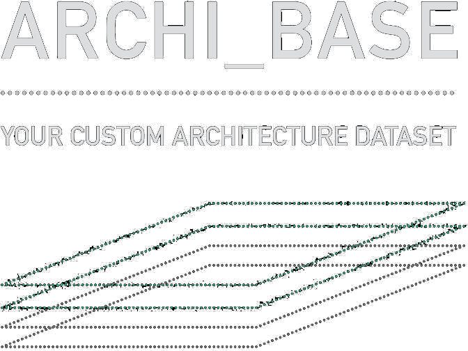
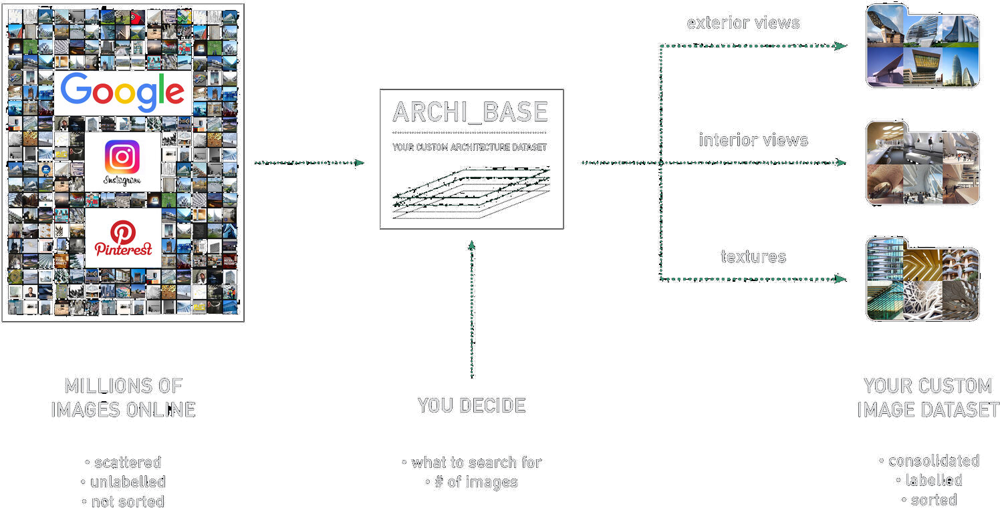
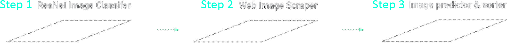
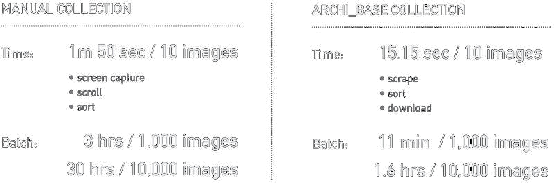

<br>




## About 

Archi-Base is an automated tool to create very large datasets of labelled and sorted architectural imagery for computer-vision model training and experiments. 

<br>

## Colab Notebook

<br>

A colab notebook has been provided to recreate the following experiment

```
1_models/2_Scraper_Predictor_Model.ipynb
```
<br>

## Project Page

Additional informatil about this project can be found on its project page on my personal website here:

<br>

```
www.michaelhasey.com/archi_base
```

## Table of Contents

<br>

- [Background](#Background)
- [Pipeline](#Dataset)
- [Model](#Model)
- [Performance](#Performance)
- [References](#References)
- [Citation](#Citation)

<br>

## Background

<br>

The current method of creating large databases of architectural image data is inadequate and slow. To create a custom image database today, a user must manually search through multiple and scattered image sources, filter through thousands of un-labelled and non-relevant images, download the correct images one by one, and then painstakingly label and sort each image into their corresponding folders to prepare for training. On average, it takes about 1 minute and 50 seconds to manually look for, download, and sort 10 images.  As a result, the manual method would take 30 hours of manual labour to build a robust dataset of 10,000 images for deep neural network training.

Archi-Base solves this problem by providing an online tool that autonomously finds, labels, and sorts architectural images according to their class (ex. image of building interior, image of building exterior, aerial image, etc.) and creates custom datasets of any size in a fraction of the time.  Instead of taking 30 hours to manually create a 10,000 image dataset, Archi-Base can complete this task in an hour with zero human interaction required. 

Using this tool, datasets of thousands of currated and labeled images of any architects designs, any building type or style and from any location can be rapidly created.  Archi-Base helps to expedite the dataset creation process by drastically reducing the time needed to find, sort and label images.  Thus, allowing researchers and practitioners to spend less time on repetative tasks, and more time on things that matter.

<br>



<br>

## Pipeline

<br>

Archi-Base uses a 2-step pipeline to create large architectural image datasets.

1. An image scraping tool that autonomously searches for and downloads user defined images from multiple online image databases.  Images can be of any building type, any building designed by a specific architect, or any buildings from a specific region. 
2. A pre-trained ResNet-32 model which classifies, labels and sorts each scraped image into a corresponding folder.  

While a robust 100,000 image dataset would take 330 hours to create manually, Archi_base completes this task in just 16 hours.

<br>
<br>



<br>

## Dataset

<br>

To train the Resnet-32 model to correctly classify,label and sort architectural imagery accordingo to their class, the following images were used as training data.

```
2_data/aerial
2_data/closeup
2_data/drawings
2_data/interior
2_data/people
2_data/posters_books
2_data/street
2_data/texture
```

- 2000 images of architectural related subjects

    - zaha hadid building images
        - 300 street view images
        - 300 interio view images
        - 300 aerial view images
        - 300 close-up view images
        - 300 architectural texture images

    - miscellaneous images
        - 200 books / posters images
        - 100 people images
        - 200 drawings / sketches images

<br>

## Model

<br>

Archi-Base uses a ResNet-32 model for Image Classification due to its superior classification abilities over standard, “vanilla” neural networks.  Here, the model has been trained to detect whether an image is of a building interior, exteriors, aerial view, or an image containing people in the foreground, or parts of buildings, or building textures. Once learned, our model can classify whether new images belong to any of these class categories and then label and sort them into folders accordingly.

<br>

To run Archi-Base, follow the instructions and steps within the provided notebook in the repo.

```
1_models/2_Scraper_Predictor_Model.ipynb
```
<br>

## Performance

<br>

See below to see performance based benchmarks comparing the time in which it takes Archi-Base to build large image datasets vs. manually creating a similarly-sized dataset by hand.

<br>



<br>

## References

<br>

1. Yolo-V3 [https://github.com/eriklindernoren/PyTorch-YOLOv3](https://github.com/eriklindernoren/PyTorch-YOLOv3)
2. labelImg[https://github.com/tzutalin/labelImg] (https://github.com/tzutalin/labelImg)

## Citation

<br>

If you find this project useful in your research, please consider citing:

``` 
@misc{mhasey2021,
    title={Maasai Skywatch},
    author={Michael Hasey},
    year={2020},
}
```
